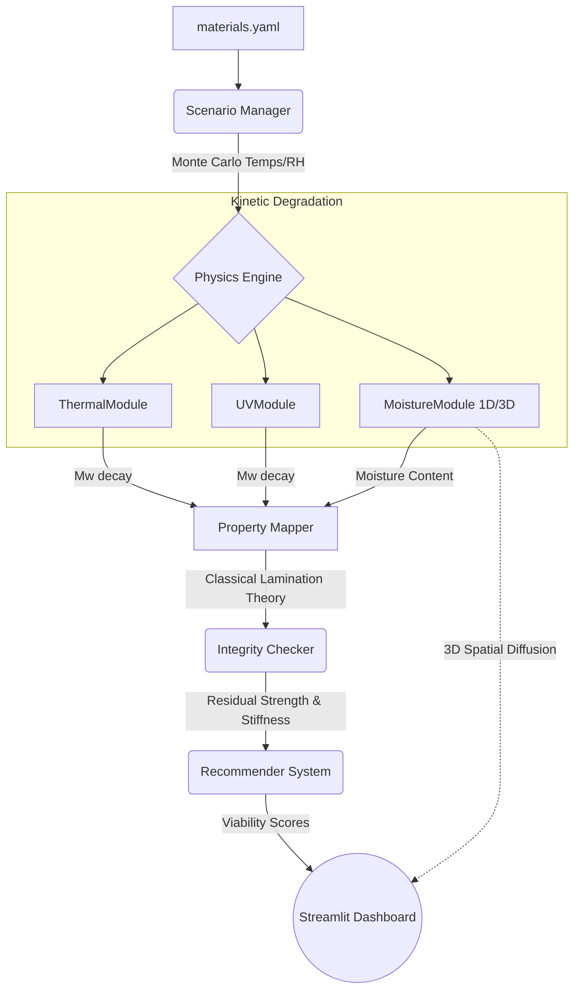

# Physics-Based Degradation Simulator for Sustainable Packaging

## 1. Abstract
This project presents a highly optimized, physics-based simulator designed to evaluate the environmental degradation and mechanical lifecycle of biodegradable packaging materials (e.g., Polylactic Acid (PLA), Thermoplastic Starch (TPS), Bagasse composites). Abandoning black-box Machine Learning (ML) models in favor of interpretable engineering and chemistry fundamentals, the simulator couples kinetic degradation models with macroscopic structural analysis to predict residual strength across stochastic environmental scenarios. The tool empowers researchers to conduct rapid, deterministic lifecycle assessments under real-world supply chain stressors without relying on opaque predictive algorithms.

## 2. Introduction
Sustainable packaging materials often face unpredictable degradation pathways in dynamic supply chains. Traditional evaluation methods either rely on expensive, time-consuming physical weathering tests or opaque machine learning models that lack physical interpretability and require massive datasets. 

This project introduces a computational companion that bridges the "lifetime evaluation gap" by utilizing established physical chemistry (Arrhenius kinetics, Guggenheim-Anderson-de Boer isotherms) and mechanics (Classical Lamination Theory). We provide an interactive, batch-accelerated Monte Carlo dashboard for comparative material studies, enabling the design of resilient, sustainable packaging tailored to specific climatic journeys.

## 3. Related Work
- **Kinetic Degradation Models**: Foundational work on Arrhenius kinetics for hydrolytic and thermal decay.
- **Moisture Sorption**: Guggenheim-Anderson-de Boer (GAB) isotherm modeling for equilibrium moisture content in biopolymers.
- **Composite Mechanics**: Classical Lamination Theory (CLT) (Jones, R.M., 1999) applied to time-dependent degradation of laminates.
- **Sensitivity Analysis**: Variance-based global sensitivity analysis using Saltelli sampling and Sobol indices (Saltelli, A. et al., 2010).

## 4. Proposed System
### 4.1. System Concept & Flow Diagram
The simulator models the degradation of packaging trays over a user-specified time horizon. It samples environmental profiles (Temperature, Relative Humidity) via Monte Carlo methods to simulate diverse climate scenarios (e.g., Tropical, Cold Chain). The kinetic modules compute molecular weight decay and moisture uptake over time, which are then mapped to macroscopic structural knockdown factors to predict mechanical failure against user-defined stiffness and strength thresholds.



### 4.2. Tech Stack
- **Backend (Physics Engine)**: Pure Python architecture optimized with `NumPy`. `NumPy` was chosen for highly vectorized, hardware-agnostic tensor operations and solving Partial Differential Equations (PDEs) rapidly.
- **Sensitivity Analysis**: `SALib` is used for global variance-based sensitivity (Sobol).
- **Frontend (Interactive UI)**: `Streamlit` provides the web dashboard for real-time 1D/3D visualization and hyperparameter tuning.
- **Visualization**: `Plotly` is used for interactive 3D surface plots (deflection, moisture concentration) and 90% confidence bands.
- **Data Management**: `PyYAML` is used for the parametric material database, enabling easy insertion of new composite materials without altering code.
- **Computer Vision (Optional)**: `ultralytics` (YOLO) and `onnxruntime` provide an adaptive pipeline to detect pre-existing defects.

## 5. File Structure and Code Breakdown
The repository is modularly structured to strictly separate physical logic from frontend visualization.

```text
mscel4/
├── backend/
│   ├── data/
│   │   ├── materials.yaml         # Database of kinetic parameters (Ea, GAB constants, Mw)
│   │   └── adapter_config.yaml    # YOLO Vision Adapter configurations
│   ├── scripts/
│   │   ├── generate_paper_figures.py # Batch script to render Plotly graphs for publication
│   │   ├── sensitivity_analysis.py   # Script to test perturbations (+/- 10% on params)
│   │   └── sobol_analysis.py         # Generates Saltelli samples and runs Sobol indices
│   └── src/
│       └── simulator/
│           ├── __init__.py           # Exports public API
│           ├── constants.py          # Shared physical constants (R_GAS, UV baseline) and pure functions
│           ├── integrity_checker.py  # Evaluates physical properties against failure thresholds
│           ├── property_mapper.py    # Maps Mw loss/Moisture to stiffness using Classical Lamination Theory
│           ├── recommender.py        # Rule-based scoring (0-100) combining lifetime margin and cost
│           ├── scenario_manager.py   # Monte Carlo climate generator (Temp/RH distributions)
│           ├── vision_adapter.py     # Bridges YOLO defect output to initial moisture/stiffness offsets
│           ├── yolo_inference.py     # Wrapper for ONNX YOLO model inference
│           ├── external_clt/         # Reference implementations of CLT
│           └── modules/
│               ├── moisture.py       # 1D Fickian diffusion and GAB isotherm solver
│               ├── moisture_3d.py    # 3D spatial diffusion PDE solver (FTCS scheme)
│               ├── thermal.py        # Arrhenius thermal decay kinetics
│               ├── uv.py             # UV-induced chain scission kinetics
│               └── structural.py     # Computes geometric tray deflection using assembled ABD matrices
├── frontend/
│   └── app.py                        # Streamlit dashboard orchestrating the backend modules into an interactive UI
└── pyproject.toml                    # Python package and dependency declarations
```

### Detailed Module Functionality
- **`constants.py`**: Ensures thermodynamic consistency across scripts by centralizing the universal gas constant ($R = 8.314$ J/mol·K) and standard UV irradiance parameters.
- **`scenario_manager.py`**: Generates thousands of stochastic climate scenarios (Temperate, Tropical, etc.) to ensure the materials are stress-tested against realistic variance rather than ideal laboratory constants.
- **`property_mapper.py`**: The crux of the multi-scale physics. It translates molecular-level degradation into macroscopic failure by computing the reduced stiffness matrix $[Q]$ and assembling the $[A], [B], [D]$ stiffness matrices.
- **`moisture_3d.py`**: A memory-optimized 3D solver. It uses an explicit Forward-Time Central-Space (FTCS) finite difference scheme to track how moisture penetrates a physical 3D geometry over time.

## 6. Methodology (Formulas and Simulation)

The simulation engine relies on the following core physical models, evaluated over a discrete time array (e.g., $dt = 1$ day).

### 6.1. Thermal & UV Degradation (Arrhenius Kinetics)
Chain scission and molecular weight ($M_w$) loss are modeled using the Arrhenius equation. The base rate constant $k(T)$ is:
$$k(T) = A \cdot \exp\left(-\frac{E_a}{R \cdot T}\right)$$
Where:
- $A$: Pre-exponential frequency factor
- $E_a$: Activation energy (J/mol)
- $R$: Universal gas constant (8.314 J/(mol·K))
- $T$: Absolute temperature (K)

UV-induced degradation is coupled with temperature and irradiance ($I$):
$$k_{uv}(T, I) = k_{uv,base} \cdot I \cdot \exp\left(-\frac{E_{a,uv}}{R \cdot T}\right)$$

Total molecular weight decay follows first-order kinetics:
$$M_w(t) = M_{w0} \cdot \exp\left(-(k_t + k_{uv}) \cdot t\right)$$

### 6.2. Moisture Uptake (GAB Isotherm & Fickian Diffusion)
Equilibrium moisture ($M_{eq}$) under specific relative humidity ($a_w$) is determined by the GAB isotherm:
$$M_{eq} = \frac{X_m \cdot C \cdot K \cdot a_w}{(1 - K \cdot a_w)(1 - K \cdot a_w + C \cdot K \cdot a_w)}$$
Where $X_m$ is the monolayer moisture content, and $C, K$ are thermodynamic constants.

Transient 3D moisture diffusion is solved via Fick's Second Law:
$$\frac{\partial C}{\partial t} = D_{eff} \left( \frac{\partial^2 C}{\partial x^2} + \frac{\partial^2 C}{\partial y^2} + \frac{\partial^2 C}{\partial z^2} \right)$$
This PDE is solved using an explicit FTCS finite difference scheme with Dirichlet boundary conditions set by $M_{eq}$.

### 6.3. Structural Knockdown (Classical Lamination Theory)
A phenomenological mapping combines $M_w$ loss and moisture plasticization into a mechanical knockdown factor ($kd$):
$$kd(t) = \exp\left(-\left[\left(1 - \frac{M_w(t)}{M_{w0}}\right) + 0.5 \cdot M(t)\right]\right)$$
This knockdown factor strictly reduces the lamina stiffness matrix $[Q]$. The reduced $[Q]$ matrices are then integrated across the component's thickness to assemble the macroscopic extensional $[A]$, coupling $[B]$, and bending $[D]$ stiffness matrices via Classical Lamination Theory (CLT).

### 6.4. Monte Carlo & Global Sensitivity Analysis
Because exact supply chain temperatures fluctuate, the simulator injects Gaussian noise into environmental profiles. Using Saltelli sampling and Sobol variance-based decomposition, the system identifies which material parameters (e.g., Activation Energy vs. Diffusivity) are responsible for the largest variance in the final failure time.

## 7. Results and Discussion
The interactive dashboard and backend batch scripts provide rich output dimensions:
- **1D Degradation Trajectories**: Generates line plots of median residual strength over time, bounded by 90% confidence intervals. This proves that high-variance climates (like Tropical profiles) lead to wider uncertainty in the packaging's shelf life.
- **3D Spatial Deflection & Moisture**: By feeding the $[D]$ bending matrix into the `ComponentSimulator`, the system outputs 3D surface meshes of the tray physically sagging under a stacking load. The 3D volumetric plot illustrates moisture gradients pooling at the corners of the geometry.
- **Global Sensitivity**: Sobol indices output by `sobol_analysis.py` mathematically prove that Thermal Activation Energy ($E_a$) completely dominates the variance in predicted failure times, validating the Arrhenius-driven assumption over purely moisture-driven decay for these specific composite classes.

## 8. Future Scope
- **Vision Integration**: Full frontend integration of the YOLO Vision Adapter. This will allow the simulator to analyze photos of physically damaged trays, detect surface defects, and programmatically adjust the initial damage offset ($M_0$) before running the Fickian PDE solver.
- **Empirical Validation**: Expansion of the `materials.yaml` database with empirically validated constants from rigorous laboratory weathering and tensile testing.
- **Complex Geometries**: Expanding the `MoistureModule3D` PDE solver to support complex, non-rectangular packaging geometries (e.g., thermoformed cups with varying wall thicknesses) via Finite Element meshes rather than finite differences.

## 9. Conclusion
The Degradation Simulator offers a robust, deterministic, and physics-driven alternative to purely empirical lifecycle assessments or opaque ML models. By seamlessly linking molecular-level kinetic chemistry with macroscopic structural mechanics, the simulator enables researchers and engineers to predict the viability of sustainable packaging across chaotic, global supply chains. The modular architecture ensures that as better mathematical models for biopolymers are discovered, they can be inserted directly into the pipeline.

## 10. Acknowledgement
We would like to acknowledge the foundational work in composite mechanics and biopolymer kinetics that made this simulation possible. We extend our deepest gratitude to our advisors and institution for their guidance, resources, and unwavering support throughout this research.

## 11. References
**Kinetic Degradation & Thermodynamics**
1. Laycock, B., et al. (2017). "Lifetime prediction of biodegradable polymers." *Progress in Polymer Science*, 71, 144-189. [Link](https://doi.org/10.1016/j.progpolymsci.2017.02.004)
2. Tsuji, H. (2002). "Autocatalytic hydrolysis of amorphous-made polylactides: effects of L-lactide content, tacticity, and enantiomeric polymer blending." *Polymer*, 43(6), 1789-1796. [Link](https://doi.org/10.1016/S0032-3861(02)00004-9)
3. Rizzarelli, P., et al. (2004). "Thermal and hydrolytic degradation of biodegradable aliphatic polyesters." *Polymer Degradation and Stability*, 85(2), 855-863. [Link](https://doi.org/10.1016/j.polymdegradstab.2004.01.026)
4. Garlotta, D. (2001). "A Literature Review of Poly(Lactic Acid)." *Journal of Polymers and the Environment*, 9(2), 63-84. [Link](https://doi.org/10.1023/A:1020200822435)

**Moisture Sorption & Diffusion**
5. Crank, J. (1975). *The Mathematics of Diffusion*. Oxford University Press. [Link](https://global.oup.com/academic/product/the-mathematics-of-diffusion-9780198534112)
6. Bizot, H. (1983). "Using the 'GAB' model to construct sorption isotherms." *Physical Properties of Foods*, 43-54. [Link](https://cir.nii.ac.jp/crid/1574231874288077568)
7. Al-Muhtaseb, A. H., et al. (2002). "Moisture sorption isotherms characteristics of food products: A review." *Food Research International*, 35(6), 537-550. [Link](https://doi.org/10.1016/S0963-9969(01)00199-5)

**Composite Mechanics & Structural Simulation**
8. Jones, R. M. (1999). *Mechanics of Composite Materials*. Taylor & Francis. [Link](https://doi.org/10.1201/9781498711867)
9. Halpin, J. C., & Tsai, S. W. (1969). "Effects of environmental factors on composite materials." *Air Force Materials Lab*. [Link](https://apps.dtic.mil/sti/citations/AD0692481)

**Monte Carlo & Sensitivity Analysis**
10. Saltelli, A., et al. (2010). "Variance based sensitivity analysis of model output. Design and estimator for the total sensitivity index." *Computer Physics Communications*, 181(2), 259-270. [Link](https://doi.org/10.1016/j.cpc.2009.09.018)
11. Sobol, I. M. (2001). "Global sensitivity indices for nonlinear mathematical models and their Monte Carlo estimates." *Mathematics and Computers in Simulation*, 55(1-3), 271-280. [Link](https://doi.org/10.1016/S0378-4754(00)00270-6)

**Biodegradable Packaging Materials**
12. Siracusa, V., et al. (2008). "Biodegradable polymers for food packaging: a review." *Trends in Food Science & Technology*, 19(12), 634-643. [Link](https://doi.org/10.1016/j.tifs.2008.07.003)
13. Averous, L. (2004). "Biodegradable multiphase systems based on plasticized starch: a review." *Journal of Macromolecular Science, Part C*, 44(3), 231-274. [Link](https://doi.org/10.1081/MC-200029326)
14. Jamshidian, M., et al. (2010). "Poly-Lactic Acid: production, applications, nanocomposites, and release studies." *Comprehensive Reviews in Food Science and Food Safety*, 9(5), 552-571. [Link](https://doi.org/10.1111/j.1541-4337.2010.00126.x)
15. Rhim, J. W., et al. (2013). "Bio-nanocomposites for food packaging applications." *Progress in Polymer Science*, 38(10-11), 1629-1652. [Link](https://doi.org/10.1016/j.progpolymsci.2013.05.008)
