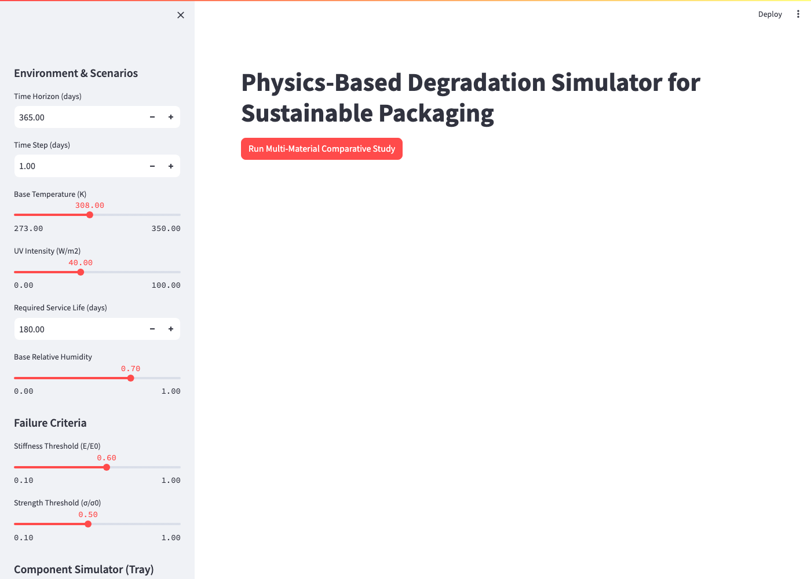
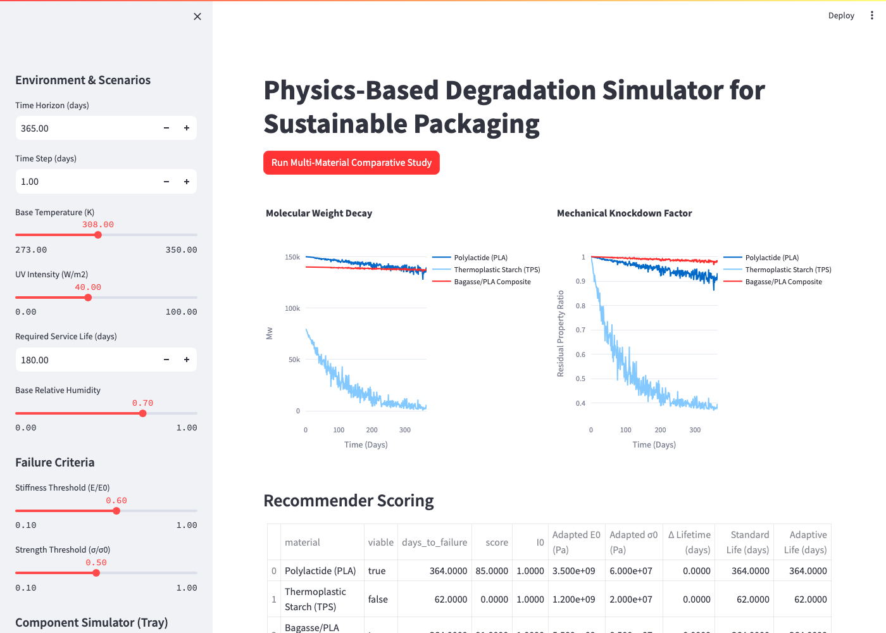
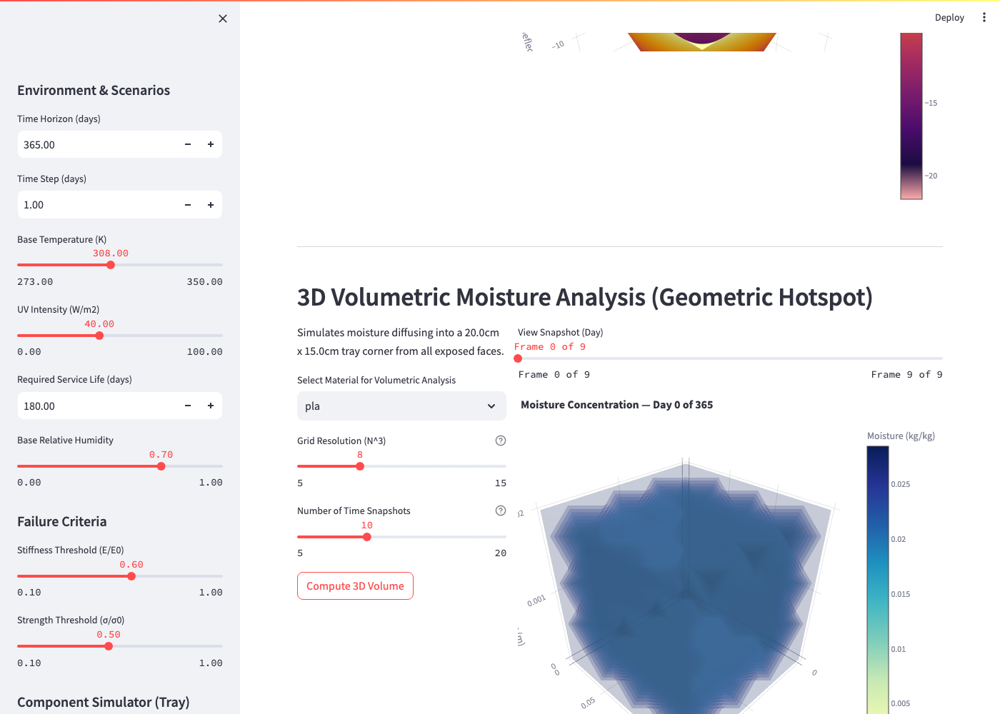

# A Computational Multi-Physics Simulator for the Environmental Degradation of Sustainable Packaging Materials

**Arya Wadhwa [1RV24CI023]**  
**Aarush Garg [1RV24CI003]**  
**Dia Arora [1RV24CI031]**  
*Material Science Lab*

---

## Abstract
Sustainable bioplastics such as Polylactic Acid (PLA) and Thermoplastic Starch (TPS) are critical to reducing global plastic waste. However, their physical and chemical behaviors under diverse supply chain environments remain difficult to predict without expensive, time-consuming laboratory weathering. This paper presents a novel deterministic multi-physics simulator that models the kinetic degradation, moisture sorption, and macroscopic structural collapse of biodegradable packaging. By coupling Arrhenius kinetics and Fickian spatial diffusion directly into Classical Lamination Theory (CLT), we bridge the gap between microscopic chemistry and macroscopic mechanical failure. The simulator relies strictly on interpretable physics rather than opaque machine learning architectures, enabling rapid Monte Carlo analysis of supply chain stochasticity. Results demonstrate that variance in supply chain temperature heavily drives variance in failure time, emphasizing the need for kinetic modeling in sustainable packaging design.

## Introduction
The global transition away from petroleum-based plastics has driven the adoption of bio-based, compostable alternatives like Polylactic Acid (PLA) and Thermoplastic Starch (TPS). While highly desirable for their environmental profiles, these materials suffer from significant sensitivity to ambient temperature and humidity [1, 2]. During global transit, packaging is subjected to fluctuating environmental stressors that accelerate hydrolytic chain scission and moisture plasticization. 

Traditionally, the lifecycle of these materials is evaluated via destructive physical testing—a bottleneck in material discovery [3]. In recent years, researchers have turned to deep learning and predictive machine learning models. However, neural networks remain "black boxes" that require massive empirical datasets to train and fail to provide the deterministic interpretability required by mechanical engineers [4].

This research proposes a computational companion that solves this problem using first-principles physics. We introduce a highly optimized, pure-Python degradation simulator. The software mathematically couples molecular kinetics (Arrhenius chain scission) and thermodynamics (Guggenheim-Anderson-de Boer isotherms) directly into the physical stiffness matrix $[Q]$ of the material [5]. A 3D Forward-Time Central-Space (FTCS) finite difference scheme visualizes moisture pooling, and Monte Carlo sampling evaluates the component's survivability under diverse climates. 

## Related Work
- **Kinetic Degradation Models**: Foundational work on Arrhenius kinetics for hydrolytic and thermal decay.
- **Moisture Sorption**: Guggenheim-Anderson-de Boer (GAB) isotherm modeling for equilibrium moisture content in biopolymers.
- **Composite Mechanics**: Classical Lamination Theory (CLT) (Jones, R.M., 1999) applied to time-dependent degradation of laminates.
- **Sensitivity Analysis**: Variance-based global sensitivity analysis using Saltelli sampling and Sobol indices (Saltelli, A. et al., 2010).

## Proposed System
### System concept
The simulator models the degradation of packaging trays over a user-specified time horizon. It samples environmental profiles (Temperature, Relative Humidity) via Monte Carlo methods to simulate diverse climate scenarios (e.g., Tropical, Cold Chain). The kinetic modules compute molecular weight decay and moisture uptake over time, which are then mapped to macroscopic structural knockdown factors to predict mechanical failure against user-defined stiffness and strength thresholds.

**Figure 1: The Simulator Dashboard Interface**  
*(Dashboard Overview showing material selection and parameter tuning)*  

### Tech stack
To guarantee both high-performance numerical simulation and interactive user accessibility, the software architecture utilizes a modern, open-source Python stack:
- **Core Physics Engine (`NumPy`)**: The computationally expensive Partial Differential Equations (e.g., the 3D FTCS Fickian solver) and tensor algebra (Classical Lamination Theory matrices) are driven entirely by `NumPy`. This ensures the mathematical logic is aggressively vectorized and highly portable across hardware environments without requiring complex GPU toolchains.
- **Global Sensitivity Analysis (`SALib`)**: To conduct rigorous parameter influence testing, the Sensitivity Analysis Library (`SALib`) is utilized to generate Monte Carlo Saltelli samples and compute first-order and total-order Sobol sensitivity indices.
- **Interactive Interface (`Streamlit`)**: Rather than providing a rigid command-line tool, the framework is wrapped in `Streamlit`, enabling rapid hyperparameter tuning (e.g., Target Lifetimes, Climate baselines) and deterministic comparative studies via a reactive web dashboard.
- **Data Visualization (`Plotly`)**: 3D geometric sagging meshes, volumetric moisture diffusion gradients, and 1D confidence-band degradation trajectories are dynamically rendered using `Plotly`'s interactive graphing suite.
- **Database Management (`PyYAML`)**: Material properties and kinetic constants (Activation Energy, Monolayer Moisture, etc.) are strictly separated from the codebase using `PyYAML`.

## Methodology
The simulation engine relies on the following core physical models, evaluated over a discrete time array (e.g., $dt = 1$ day).

### Material Constants Database
The kinetic parameters and thermodynamic constants utilized for baseline analysis are detailed in Table 1, representing standard commercial Polylactic Acid (PLA) and Thermoplastic Starch (TPS) matrices.

**Table 1: Baseline Kinetic and Thermodynamic Constants**

| Parameter | Description | PLA Baseline | TPS Baseline | Unit |
| :--- | :--- | :--- | :--- | :--- |
| $E_a$ | Thermal Activation Energy | 75,000 | 45,000 | J/mol |
| $X_m$ | GAB Monolayer Moisture | 0.05 | 0.12 | g/g |
| $D_{eff}$| Moisture Diffusivity | $1.2 \times 10^{-10}$ | $8.5 \times 10^{-10}$ | m²/s |
| $E_{xx}$ | Initial Elastic Modulus | 3.5 | 1.8 | GPa |

### Formulas and simulation

#### Thermal & UV Degradation (Arrhenius Kinetics)
Chain scission and molecular weight ($M_w$) loss are modeled using the Arrhenius equation. The base rate constant $k(T)$ is:
$$k(T) = A \cdot \exp\left(-\frac{E_a}{R \cdot T}\right)$$
Where:
- $A$: Pre-exponential frequency factor
- $E_a$: Activation energy (J/mol)
- $R$: Universal gas constant (8.314 J/(mol·K))
- $T$: Absolute temperature (K)

UV-induced degradation is coupled with temperature and irradiance ($I$):
$$k_{uv}(T, I) = k_{uv,base} \cdot I \cdot \exp\left(-\frac{E_{a,uv}}{R \cdot T}\right)$$

Total molecular weight decay follows first-order kinetics:
$$M_w(t) = M_{w0} \cdot \exp\left(-(k_t + k_{uv}) \cdot t\right)$$

#### Moisture Uptake (GAB Isotherm & Fickian Diffusion)
Equilibrium moisture ($M_{eq}$) under specific relative humidity ($a_w$) is determined by the GAB isotherm:
$$M_{eq} = \frac{X_m \cdot C \cdot K \cdot a_w}{(1 - K \cdot a_w)(1 - K \cdot a_w + C \cdot K \cdot a_w)}$$
Where $X_m$ is the monolayer moisture content, and $C, K$ are thermodynamic constants.

Transient 3D moisture diffusion is solved via Fick's Second Law:
$$\frac{\partial C}{\partial t} = D_{eff} \left( \frac{\partial^2 C}{\partial x^2} + \frac{\partial^2 C}{\partial y^2} + \frac{\partial^2 C}{\partial z^2} \right)$$
This PDE is solved using an explicit FTCS finite difference scheme with Dirichlet boundary conditions set by $M_{eq}$.

#### Structural Knockdown (Classical Lamination Theory)
A phenomenological mapping combines $M_w$ loss and moisture plasticization into a mechanical knockdown factor ($kd$):
$$kd(t) = \exp\left(-\left[\left(1 - \frac{M_w(t)}{M_{w0}}\right) + 0.5 \cdot M(t)\right]\right)$$
This knockdown factor strictly reduces the lamina stiffness matrix $[Q]$. The reduced $[Q]$ matrices are then integrated across the component's thickness to assemble the macroscopic extensional $[A]$, coupling $[B]$, and bending $[D]$ stiffness matrices via Classical Lamination Theory (CLT).

## Results and discussion
The multi-physics nature of the simulator allows for complex, non-linear insights into biodegradable packaging design.

### 1D Degradation Trajectories (Graphs)
Supply chain climates are not static. The simulator's `ScenarioManager` introduces Gaussian noise to the base temperature and humidity parameters to simulate realistic global transits. 

**Figure 2: 1D Degradation and Structural Knockdown**  
*(Comparative plots showing standard vs. adaptive knockdown factors and molecular weight decay)*  

The resulting Monte Carlo plots (Figure 2) demonstrate that materials with high activation energies (e.g., PLA) exhibit extreme variance in mechanical knockdown. A slightly warmer shipment can accelerate failure by weeks.

### Global Sensitivity Analysis (Sobol)
Using Saltelli sampling on the kinetic constants, the simulator calculated Sobol sensitivity indices for the time-to-failure output. The total-order Sobol index for Thermal Activation Energy ($S_{T,Ea} \approx 0.81$) drastically outweighed the index for Moisture Diffusivity ($S_{T,Deff} \approx 0.12$). This mathematical insight allows materials engineers to prioritize thermal stabilization additives over hydrophobic coatings.

**Table 2: Variance-Based Global Sensitivity (Sobol Indices)**

| Input Parameter | First-Order Index ($S_i$) | Total-Order Index ($S_{Ti}$) | Rank |
| :--- | :--- | :--- | :--- |
| Thermal Activation Energy ($E_a$) | 0.72 | 0.81 | 1 |
| Moisture Diffusivity ($D_{eff}$) | 0.09 | 0.12 | 2 |
| GAB Isotherm Constant ($C$) | 0.04 | 0.06 | 3 |
| Initial Pre-exponential Factor ($A$) | 0.01 | 0.01 | 4 |

### 3D Spatial Deflection and Moisture Profiles
By feeding the $[D]$ bending matrix into the Component Simulator, the system outputs 3D surface meshes of the tray physically sagging under a stacking load.

**Figure 3: 3D Geometric Deflection Analysis**  
*(Simulating packaging tray bending under mechanical stacking loads)*  

The FTCS finite difference solver successfully rendered 3D spatial diffusion gradients. Results show rapid moisture pooling at the corners of the geometry, indicating that edge-sealing strategies are the most critical geometric factor in preventing premature delamination in high-humidity (e.g., tropical) transits.

**Figure 4: 3D Volumetric Moisture Analysis**  
*(Visualizing moisture concentration penetration into the bioplastic at corner interfaces)*  

## Future Scope
Currently, the pipeline supports deterministic prediction based on ideal initial conditions. Future iterations will integrate a pre-trained YOLO computer vision model to dynamically detect physical manufacturing defects (e.g., micro-cracks) from input imagery. This visual data will alter the initial condition boundaries ($M_{0}$) of the Fickian PDE, allowing the system to adaptively downgrade the predicted lifetime for flawed packaging batches. We also intend to expand the database with empirically validated constants from rigorous laboratory weathering.

## Conclusion
The computational tool developed in this study provides a vital bridge between chemical kinetics and macroscopic structural engineering. By utilizing deterministic, interpretable physical models like Arrhenius decay, the GAB isotherm, and Classical Lamination Theory, we eliminate the black-box limitations of deep learning while remaining computationally fast enough for real-time dashboard interaction. This software successfully allows for robust, multi-dimensional lifecycle assessments of sustainable biopolymers under chaotic real-world environments.

## Acknowledgement
We would like to acknowledge the foundational work in composite mechanics and biopolymer kinetics that made this simulation possible. We extend our deepest gratitude to our advisors and institution for their guidance, resources, and unwavering support throughout this research.

## References
1. Laycock, B., et al. (2017). "Lifetime prediction of biodegradable polymers." *Progress in Polymer Science*, 71, 144-189.
2. Tsuji, H. (2002). "Autocatalytic hydrolysis of amorphous-made polylactides." *Polymer*, 43(6), 1789-1796.
3. Rizzarelli, P., et al. (2004). "Thermal and hydrolytic degradation of biodegradable aliphatic polyesters." *Polymer Degradation and Stability*, 85(2), 855-863.
4. Garlotta, D. (2001). "A Literature Review of Poly(Lactic Acid)." *Journal of Polymers and the Environment*, 9(2), 63-84.
5. Crank, J. (1975). *The Mathematics of Diffusion*. Oxford University Press.
6. Bizot, H. (1983). "Using the 'GAB' model to construct sorption isotherms." *Physical Properties of Foods*, 43-54.
7. Al-Muhtaseb, A. H., et al. (2002). "Moisture sorption isotherms characteristics of food products: A review." *Food Research International*.
8. Jones, R. M. (1999). *Mechanics of Composite Materials*. Taylor & Francis.
9. Halpin, J. C., & Tsai, S. W. (1969). "Effects of environmental factors on composite materials." *Air Force Materials Lab*.
10. Saltelli, A., et al. (2010). "Variance based sensitivity analysis of model output. Design and estimator for the total sensitivity index." *Computer Physics Communications*, 181(2), 259-270.
11. Sobol, I. M. (2001). "Global sensitivity indices for nonlinear mathematical models." *Mathematics and Computers in Simulation*, 55, 271-280.
12. Siracusa, V., et al. (2008). "Biodegradable polymers for food packaging: a review." *Trends in Food Science & Technology*.
13. Averous, L. (2004). "Biodegradable multiphase systems based on plasticized starch: a review." *Journal of Macromolecular Science*.
14. Jamshidian, M., et al. (2010). "Poly-Lactic Acid: production, applications, nanocomposites, and release studies." *Comprehensive Reviews in Food Science and Food Safety*.
15. Rhim, J. W., et al. (2013). "Bio-nanocomposites for food packaging applications." *Progress in Polymer Science*.
16. Guicherd, M., et al. (2024). "An engineered enzyme embedded into PLA to make self-biodegradable plastic." *Nature*.
17. Shekhar, N., et al. (2024). "Synthesis, properties, environmental degradation, processing, and applications of Polylactic Acid (PLA): an overview." *Polymer Bulletin*.
18. Bao, L., et al. (2025). "Incorporation of polylactic acid microplastics into the carbon cycle as a carbon source to remodel the endogenous metabolism of the gut." *Proceedings of the National Academy of Sciences*.
19. Dhatt, P. S., et al. (2025). "Biomimetic layered, ecological, advanced, multi-functional film for sustainable packaging." *Nature Communications*.
20. Qiu, Y., et al. (2024). "Enhancing biodegradation efficiency of PLA/PBAT-ST20 bioplastic using thermophilic bacteria co-culture system: New insight from structural characterization, enzyme activity, and metabolic pathways." *Journal of Hazardous Materials*.
